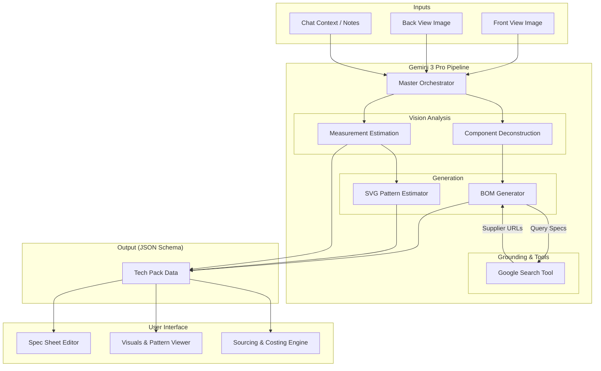
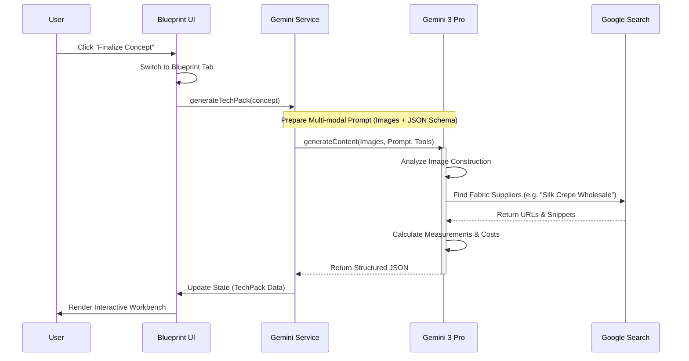

# 🧵 Blueprint Lab: Technical Design & Production Architecture

## 1. Executive Summary
The **Blueprint Lab** is the "production-ready" engine of ChowdiStudio. While the *Studio* creates the vision and *Runway* sells the dream, the *Blueprint Lab* provides the instructions to build it. 

It utilizes multimodal AI to convert purely visual concepts (pixels) into structured manufacturing data (vectors, text, and numbers), effectively generating an industry-standard **Tech Pack**.

---

## 2. Visual Architecture Overview



## 3. Core Features

### A. Automated Tech Pack Generation
*   **Visual-to-Technical Translation:** The AI analyzes the finalized Front/Back view images to deduce construction methods (e.g., "Princess seams," "Raglan sleeves," "Blind hem").
*   **Measurement Prediction:** Based on a standard reference (e.g., Sample Size M), the AI estimates key points of measure (POMs) such as bust, waist, hip, and inseam length relative to the image proportions.

### B. Intelligent Bill of Materials (BOM) & Sourcing
*   **Fabric Recognition:** Identifies textures (Velvet, Denim, Silk Charmeuse) and suggests specific weights (GSM) and yarn counts.
*   **Sourcing Agent (Grounding):** Uses **Google Search Grounding** to find *real-world* suppliers for the identified fabrics. It will return actual links to fabric mills or vendors matching the design's aesthetic.

### C. Pattern Block Estimation (Vector AI)
*   **SVG Topology:** The AI will generate a simplified SVG wireframe representing the flat pattern blocks (bodice, skirt, sleeve) required to construct the garment.
*   **Usage:** This serves as a visual guide for pattern makers, not a CAD-ready .DXF file, but a high-fidelity reference.

### D. Costing & Yield Calculator
*   **Yield Estimation:** AI calculates fabric consumption (e.g., "Requires 2.4 yards of 60-inch width fabric").
*   **Dynamic Costing:** Users can input fabric costs, and the system auto-calculates the estimated Cost of Goods Sold (COGS).

---

## 4. AI Architecture & Data Flow

### Models & Configuration
*   **Primary Model:** `gemini-3-pro-preview` (Reasoning & Vision).
*   **Role:** "Senior Garment Technologist & Production Manager".
*   **Output Format:** Strict **JSON Schema** (for UI rendering).

### Technical Workflow



### JSON Schema Structure
```json
{
  "style_number": "CS-2025-001",
  "construction_notes": ["Double-needle topstitch on yoke", "Invisible zipper at center back"],
  "bill_of_materials": [
    { "item": "Main Fabric", "spec": "100% Silk Crepe de Chine", "gsm": 120, "placement": "Body" },
    { "item": "Lining", "spec": "Cupro/Bemberg", "placement": "Interior" }
  ],
  "measurements_cm": { "bust": 92, "waist": 74, "length_hps": 110 },
  "sourcing_links": [ { "title": "Mood Fabrics - Silk", "url": "..." } ]
}
```

---

## 5. User Operation Flow

### Phase 1: Initiation
1.  User clicks **"Finalize Design"** in the *Studio* tab.
2.  System transitions to *Blueprint Lab*.
3.  **Loading State:** "Analyzing Seams...", "Estimating Fabric Yield...", "Searching Suppliers...".

### Phase 2: The Workbench (UI)
The screen is divided into three interactive columns:

*   **Left: The Spec Sheet (Editable)**
    *   Form fields pre-filled by AI (Style Name, Fabrication, Stitch Details).
    *   User can override AI suggestions (e.g., change "Silk" to "Polyester" -> updates cost instantly).

*   **Center: The Visuals**
    *   Top: The Original Design Images (Front/Back).
    *   Bottom: **AI Pattern Preview**. An overlay showing the exploded view of pattern pieces.

*   **Right: Sourcing & Costing**
    *   **Smart Sourcing List:** Cards showing real fabric suppliers found via Google Search.
    *   **Cost Sheet:** A table calculating Fabric Cost + Trims + Labor (estimated) = Total Unit Cost.

### Phase 3: Export
1.  User clicks **"Export Tech Pack"**.
2.  System generates a formatted **PDF** containing all the above data.
3.  User downloads the file to send to a manufacturer.

---

## 6. UI/UX Considerations

*   **Aesthetics:** "Industrial Chic". Monospaced fonts, grid lines, technical iconography.
*   **Interactivity:** Hovering over a BOM item (e.g., "Zipper") highlights the zipper location on the visual image (using coordinate mapping if possible, or simple tooltips).
*   **Feedback:** If the user changes the fabric weight to "Heavy", the AI should warn: "Warning: Heavy fabric may not drape as shown in the original concept."

## 7. Implementation Roadmap

1.  **Step 1:** Define the `TechPack` TypeScript interfaces and JSON Schema.
2.  **Step 2:** Update `GeminiService` with a `generateTechPack` function using `gemini-3-pro` and `responseSchema`.
3.  **Step 3:** Implement the Sourcing Agent using the `googleSearch` tool.
4.  **Step 4:** Build the React UI (`BlueprintLab.tsx`) with editable fields.
5.  **Step 5:** Integrate PDF generation library (`jspdf` or `react-pdf`).
